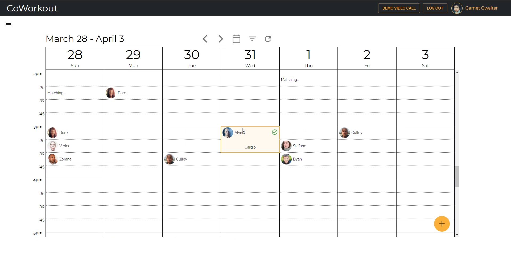
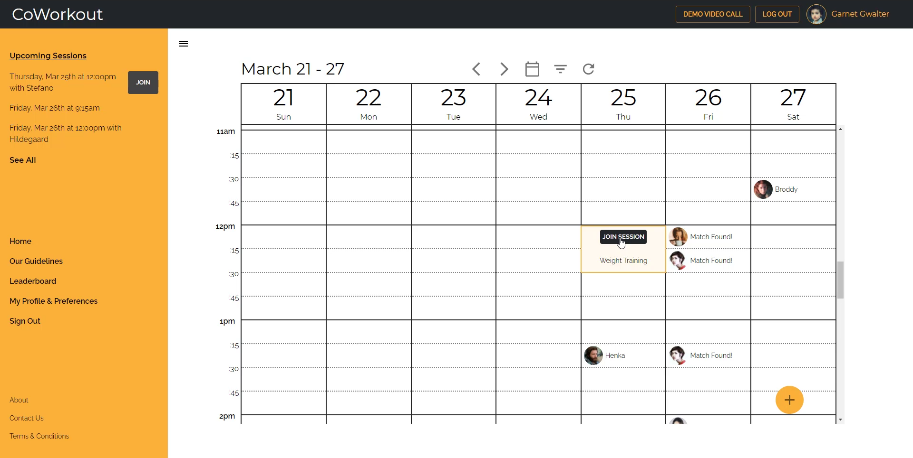
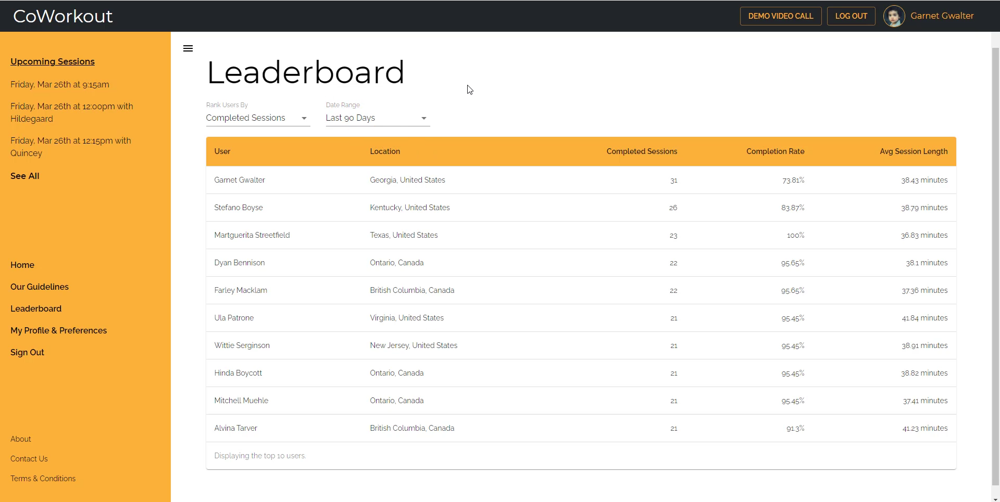

# CoWorkout

## About
CoWorkout is a peer-to-peer video matchmaking platform for fitness enthusiasts that helps users stick to their fitness goals and keep them motivated by engaging in online video workouts. Built with Node, Express and PostgreSQL in the back end and React in the front end, with Material UI used for styling.

## Features
- Interactive calendar-scheduler that can be used to match users up with fitness buddies around the world.
- Integrated video call service that allows for two or more users to conduct workout sessions in real time.
- Public user profiles, including goals, interests, achievements and statistics regarding their workout sessions.

## Screenshots

